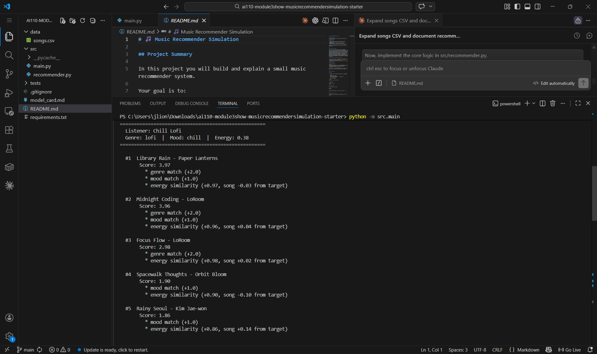

# 🎵 Music Recommender Simulation

## Project Summary

In this project you will build and explain a small music recommender system.

Your goal is to:

- Represent songs and a user "taste profile" as data
- Design a scoring rule that turns that data into recommendations
- Evaluate what your system gets right and wrong
- Reflect on how this mirrors real world AI recommenders

Replace this paragraph with your own summary of what your version does.

---


## How The System Works

Real-world music recommenders use two main strategies: **collaborative filtering** learns from the behavior of many users — if listeners who loved Song A also loved Song B, the system recommends Song B to new fans of Song A, without ever inspecting the songs themselves. **Content-based filtering**, by contrast, analyzes the attributes of the songs directly — things like genre, mood, and energy — and recommends songs whose features closely match a specific user's stated preferences. Most production systems (like Spotify or YouTube Music) blend both approaches, using collaborative signals to discover surprising matches and content signals to explain or refine them.

**Features used by this system's objects:**

- `Song`: `genre`, `mood`, `energy` (core scoring features); `tempo_bpm`, `valence`, `danceability`, `acousticness` (stored, available for future scoring)
- `UserProfile`: preferred `genre`, preferred `mood`, target `energy` level

### Algorithm Recipe

| Signal | Points |
|---|---|
| Genre match (song genre == user's preferred genre) | +2.0 |
| Mood match (song mood == user's preferred mood) | +1.0 |
| Energy similarity (`1.0 - abs(song.energy - user.target_energy)`) | +0.0 to +1.0 |

**Potential bias:** This system might over-prioritize genre, ignoring great songs that just match the user's mood.

---

## Sample Output

**High-Energy Pop**


**Chill Lofi**



**Deep Intense Rock**


---

## Getting Started

### Setup

1. Create a virtual environment (optional but recommended):

   ```bash
   python -m venv .venv
   source .venv/bin/activate      # Mac or Linux
   .venv\Scripts\activate         # Windows

2. Install dependencies

```bash
pip install -r requirements.txt
```

3. Run the app:

```bash
python -m src.main
```

### Running Tests

Run the starter tests with:

```bash
pytest
```

You can add more tests in `tests/test_recommender.py`.

---

## Experiments You Tried

Use this section to document the experiments you ran. For example:

- What happened when you changed the weight on genre from 2.0 to 0.5
- What happened when you added tempo or valence to the score
- How did your system behave for different types of users

---

## Limitations and Risks

Summarize some limitations of your recommender.

Examples:

- It only works on a tiny catalog
- It does not understand lyrics or language
- It might over favor one genre or mood

You will go deeper on this in your model card.

---

## Reflection

Read and complete `model_card.md`:

[**Model Card**](model_card.md)

Write 1 to 2 paragraphs here about what you learned:

- about how recommenders turn data into predictions
- about where bias or unfairness could show up in systems like this


---

## 7. `model_card_template.md`

Combines reflection and model card framing from the Module 3 guidance. :contentReference[oaicite:2]{index=2}  

```markdown
# 🎧 Model Card - Music Recommender Simulation

## 1. Model Name

**GrooveMatch 1.0**

---

## 2. Intended Use

GrooveMatch 1.0 suggests songs from a small catalog that best fit a user's preferred genre, mood, and energy level. It is built for classroom exploration of how recommendation systems work and is not intended for real users or production deployment. It assumes every user can describe their taste with three values: a genre, a mood word, and a target energy between 0.0 and 1.0.

---

## 3. How It Works (Short Explanation)

For each song in the catalog, the system checks three things against what the user said they want.

First, does the genre match? If yes, the song gets 2 points. Genre is weighted the most because it tends to be the strongest signal for what someone is in the mood to hear.

Second, does the mood match? A match adds 1 point. Mood captures something different from genre — a jazz song and a lofi song can both be "chill," so this signal helps across genre boundaries.

Third, how close is the song's energy to the user's target? Energy is a number from 0 (very calm) to 1 (very intense). The closer it is, the more points it earns — up to 1 full point for an exact match, down to near zero for a song on the opposite end of the spectrum.

The three values are added up, and the songs are sorted from highest to lowest. The top five are returned as recommendations, each with a plain-English explanation of what contributed to its score.

---

## 4. Data

The catalog has 20 songs stored in `data/songs.csv`. Ten songs came with the starter project, covering pop, lofi, rock, ambient, jazz, synthwave, and indie pop. Ten more were added to broaden coverage: country, electronic, folk, metal, R&B, classical, funk, latin, K-pop, and a second synthwave entry. Moods represented include happy, chill, intense, relaxed, focused, and moody.

The data has clear limits. Twenty songs is tiny compared to any real streaming service. The mood and genre labels are hand-assigned, not derived from audio analysis. The catalog skews toward Western and English-language music, so a user whose taste sits outside those genres would not be well served. Attributes like valence, danceability, and acousticness are stored in the CSV but not yet used by the scoring algorithm.

---

## 5. Strengths

The system works best when the user has a clear, specific preference that matches a genre in the catalog. The "Chill Lofi" profile, for example, consistently surfaced both lofi tracks ahead of everything else, which felt exactly right. Because the scoring is additive and fully logged, every recommendation comes with a clear explanation — you can see at a glance whether a song ranked high because of genre, mood, energy, or some combination. That transparency is something real recommenders often sacrifice in exchange for complexity.

---

## 6. Limitations and Bias

Genre match is worth 2 points while mood match is only worth 1, and energy can add at most 1 more. This means genre dominates every result. A user asking for "happy pop" will always see pop songs at the top — even a pop song with a poor energy match will usually outscore a non-pop song that perfectly nails both the mood and energy target. This is a textbook filter bubble: the system reinforces the genre the user already said they like instead of surfacing songs that might genuinely fit the moment. The catalog also has only one rock song and one metal song, so users who prefer those genres get one strong match at most and then fall through to weaker alternatives. The system treats every user session identically — it has no memory, no listening history, and no way to adjust for a user whose taste shifts over time.

---

## 7. Evaluation

Three user profiles were tested end-to-end and their outputs were inspected manually:

- **High-Energy Pop** (pop / intense / 0.90): "Gym Hero" ranked first with 3.97 points, earning both the genre and mood bonus plus near-perfect energy. This matched expectations.
- **Chill Lofi** (lofi / chill / 0.38): The two lofi tracks took the top two spots, with the one closer in energy ranked first. Expected and correct.
- **Deep Intense Rock** (rock / intense / 0.92): "Storm Runner" ranked first at 3.99. Positions two through five were all non-rock songs that matched mood or energy, which exposed how thin the rock section of the catalog is and confirmed the genre-dominance issue in practice.

One specific observation: "Sunrise City" (a pop song) made it into the Rock profile's top five purely on energy similarity with no genre or mood bonus at all. That result would likely confuse a real user and confirmed the system needs a broader catalog to be useful for less-represented genres.

---

## 8. Future Work

- **Add collaborative filtering.** The system currently only looks at song attributes. Incorporating signals from what other users with similar profiles listened to would let it find songs that content matching alone would miss — the classic "you might not think you'd like this, but people like you love it" case.
- **Use the full feature set and rebalance weights.** Valence, danceability, and acousticness are already stored in the CSV but ignored. Adding them to the score and reducing the genre weight from 2.0 to something closer to 1.0 would cut down the filter bubble and make recommendations more sensitive to the overall feel of a song rather than just its label.

---

## 9. Personal Reflection

Using AI assistance to generate the boilerplate — loading the CSV, setting up the data classes, wiring up the CLI loop — saved a lot of time on the parts of the project that were mechanical rather than conceptual. That said, I still had to read through the scoring function myself to make sure the energy formula was correct; the logic looked plausible on first read but needed a second pass to verify the range stayed between 0 and 1 and the sign was right. The most surprising thing was how reasonable the output felt given how simple the algorithm is — three numbers, a sort, and a slice, and it actually surfaces sensible recommendations for each profile. That made it much easier to understand why a slightly more sophisticated version of this logic could run a real product. If I built this again I would add collaborative filtering from day one, because content-based filtering alone will always be limited by whatever labels happen to be in the dataset.

